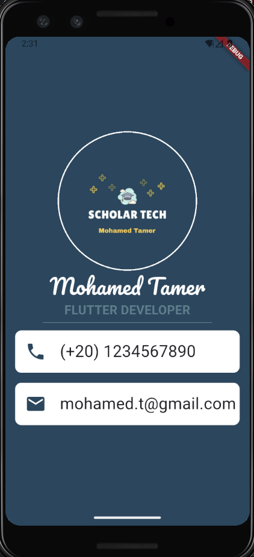

# Business Card App

A simple Flutter application that displays a digital business card. This app demonstrates basic Flutter widgets, layout, and styling.

## Features

- Name and job title display
- Contact information (phone, email, etc.)
- Clean and modern UI

## Screenshot



## Getting Started

To run this project locally:

1. **Clone the repository:**
   ```sh
   git clone <repository-url>
   cd business_card_app
   ```

2. **Install dependencies:**
   ```sh
   flutter pub get
   ```

3. **Run the app:**
   ```sh
   flutter run
   ```

## Project Structure

- `lib/main.dart`: Main entry point and UI code.
- `pubspec.yaml`: Project dependencies and assets.

## Resources

- [Flutter Documentation](https://docs.flutter.dev/)
- [Write your first Flutter app](https://docs.flutter.dev/get-started/codelab)
- [Flutter Cookbook](https://docs.flutter.dev/cookbook)

